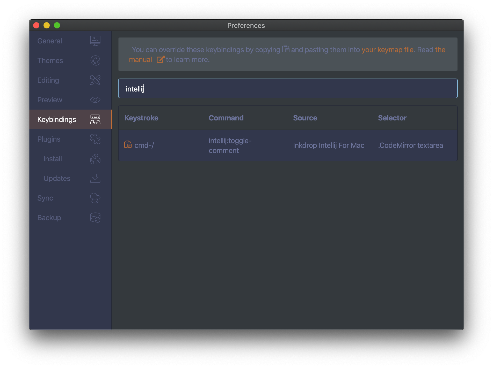

# IntelliJ keybindings for Inkdrop

Provide keybindings for IntelliJ of MacOS.

## Features

It's based on the [official key map](https://resources.jetbrains.com/storage/products/intellij-idea/docs/IntelliJIDEA_ReferenceCard.pdf).  

### Editing

| Keystroke | Command                 |                                     |
|-----------|-------------------------|-------------------------------------|
| ⌘/        | intellij:toggle-comment | Comment/uncomment with line comment |

### Key customizations

Default keymaps are defined [here](https://github.com/kitwtnb/inkdrop-intellij-for-mac/blob/master/keymaps/inkdrop-intellij-for-mac.json), and you can override them in your `keymap.cson` file.


You can check current keybindings on the *Keybindings* pane on preferences window:




## Install

```sh
$ ipm install intellij-keybindings-for-mac
```
